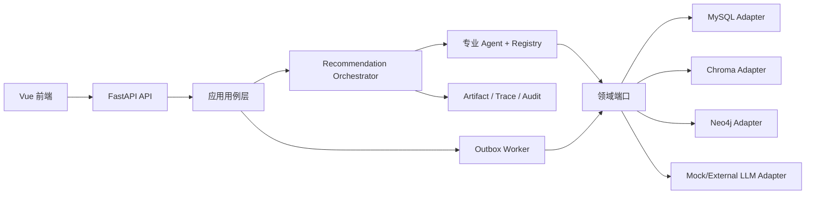
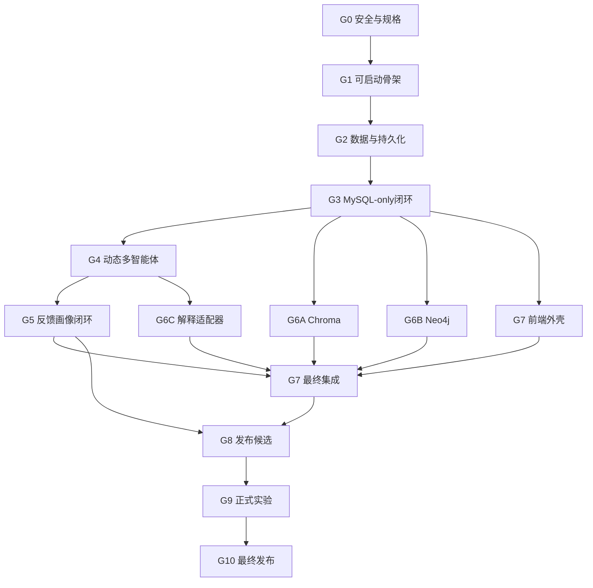

# LibraMAS 系统实施计划（安全、低耦合、高内聚版）

> 计划版本：1.0
> 制定日期：2026-08-02
> 需求基线：[LibraMAS_纯推荐模块实施文档_可运行版.md](./LibraMAS_纯推荐模块实施文档_可运行版.md)
> 基线 SHA-256：`94dffd98d7bf22755cd8c48f536b8586666db68600bbe9420c446505bdaaa1fc`
> 当前仓库状态：只有需求与实施文档，尚无后端、前端、数据库迁移或运行代码
> 最高优先级约束：未经用户查看详细报告并明确批准，不得删除任何文件或任何数据库数据

---

## 0. 计划目标与适用原则

本计划把需求文档转化为可以逐阶段执行、逐阶段验收的工程路线。实施目标不是尽快堆出全部目录，而是每完成一步都获得一个真实、可运行、可查询、可追溯的产出。

计划遵循以下顺序：

```text
先建立安全边界
→ 冻结契约和模块边界
→ 建立可启动骨架
→ 建立MySQL事实层
→ 完成MySQL-only推荐闭环
→ 完成动态多智能体协作
→ 完成曝光—反馈—画像闭环
→ 逐个接入可选能力
→ 完成前端和论文演示
→ 完成可靠性与安全门禁
→ 冻结并执行论文实验
→ 形成可复现发布版本
```

### 0.1 成功标准

系统最终必须同时满足：

1. 新环境能够通过明确命令启动。
2. 没有真实大模型 API Key 时仍可运行。
3. MySQL 是唯一事实源，Chroma 和 Neo4j 可以独立降级。
4. DIRECT、GUIDED、DEGRADED 和一次 REPLANNING 都有真实执行链。
5. 推荐、证据、曝光、反馈和画像变化形成可审计闭环。
6. 六个论文演示场景可以通过真实前后端重复执行。
7. A01—A25 自动验收全部通过。
8. 基线、消融、正式实验结果可以由独立命令复算。
9. 全过程不删除文件，不物理删除任何数据库数据。
10. 模块依赖满足本计划规定的低耦合、高内聚边界。

### 0.2 计划优先级

出现冲突时按以下优先级处理：

```text
用户最新明确指令
> 本计划的零删除安全规则
> 最新需求实施文档
> 代码中的默认行为
> 工具或框架的惯例
```

任何框架默认行为都不能绕过用户的零删除要求。

---

## 1. 零删除安全总则

### 1.1 不可破坏约束

以下规则贯穿所有阶段：

```text
1. 既有文件不得删除；移动、重命名或覆盖前必须保留可验证原版本。
2. MySQL中的既有行、表、列、索引和数据库不得物理删除。
3. Chroma集合、向量记录和持久化目录不得删除或reset。
4. Neo4j节点、关系、属性历史和数据库不得删除。
5. Docker持久卷、测试运行、实验结果、日志和备份不得自动清理。
6. 事实数据以追加方式写入；纠错和撤销使用新版本或补偿事件。
7. 任何无法证明expected_delete_count=0的变更计划默认拒绝执行。
8. Agent和LLM不得持有文件系统删除能力、数据库管理权限或自由SQL/Cypher能力。
9. 发现确实需要删除时立即停止，在执行前向用户提交完整报告。
10. 一次删除批准只适用于报告中的精确目标、环境和时间，不得扩展使用。
```

保护范围包括已跟踪和未跟踪文件、源码、配置、迁移、数据集、数据库、索引、日志、备份、实验运行目录和论文图表。

### 1.2 操作分级

| 级别 | 示例 | 默认处理 |
|---|---|---|
| S0 只读 | 查看文件、查询状态、SELECT、校验哈希 | 可以在当前任务范围内执行并记录 |
| S1 追加 | 新建文件、CREATE TABLE、ADD nullable列、INSERT新版本、创建新索引版本 | 用户启动相应实施阶段后，经过dry-run与门禁执行 |
| S2 受控更新 | 修改源码、更新运行状态白名单列、切换active version | 必须有ChangePlan、备份或原版本、影响范围和审计记录 |
| S3 破坏性 | 删除文件、物理删行、删表删列、清空集合、删卷、覆盖同名实验结果 | 立即停止；先汇报，获得用户精确批准后才可单次执行 |

用户当前只要求制定计划，因此本轮只允许 S0 和新增计划文档，不授权任何系统实现或数据库写入。

### 1.3 默认禁止进入脚本或日常命令的操作

```text
rm / unlink / rmdir / git clean / git reset --hard
DELETE / TRUNCATE / DROP / REPLACE INTO
ALTER TABLE ... DROP
ON DELETE CASCADE / ON DELETE SET NULL
alembic downgrade
Neo4j DELETE / DETACH DELETE / DROP DATABASE
Chroma delete / reset / delete_collection
docker compose down -v / docker volume rm / volume prune
覆盖同名备份、数据集、验证证据、实验run或报告
自动清理测试环境、旧索引、旧镜像、日志或缓存
```

安全扫描只扫描可执行源码、迁移、Shell、Makefile、Compose和CI配置，文档中的禁止操作说明不作为误报。

### 1.4 对原实施文档中删除语义的强制覆盖

| 原文语义 | 本计划中的唯一允许实现 |
|---|---|
| 删除少于2条资源的孤立分组 | 仅从本次响应中省略，记录 `GROUP_OMITTED_LOW_COVERAGE`，不修改持久化事实 |
| 删除阅读路径环中最低置信关系 | 只在本次拓扑计算中忽略，记录关系ID和告警，不修改Neo4j |
| 索引 `operation=DELETE` | 改为 `DEACTIVATE`，查询层过滤，旧索引记录保留 |
| 外键删除行为 | 统一使用 `RESTRICT/NO ACTION`，禁止级联删除 |
| `make demo-reset` | 改为 `make demo-prepare RUN_ID=...`，创建新Fixture代次和新用户 |
| 重置smoke用户 | 每次创建新 `test_run_id` 和用户，不覆盖旧状态 |
| 测试后销毁数据库或Chroma目录 | 只停止服务并封存运行清单，数据和目录保留 |
| 删除兴趣标签或清除历史 | 追加撤回、停用或逻辑隐藏事件，原事实保留 |
| 重建Chroma或Neo4j | 新版本命名空间构建、校验、切换活动指针，旧版本保留 |
| `make down` | 实施为 `make stop`，只停止服务并保留容器数据卷 |

### 1.5 数据权限隔离

| 身份 | 最小权限 | 明确禁止 |
|---|---|---|
| `recpro_runtime` | SELECT、INSERT；少量投影表白名单UPDATE | DELETE、DROP、ALTER、TRUNCATE、GRANT |
| `recpro_worker` | SELECT、INSERT；Outbox白名单UPDATE | DELETE和所有DDL |
| `recpro_migrator` | CREATE、受控ALTER、INDEX、REFERENCES | DELETE、TRUNCATE、DROP |
| `recpro_readonly` | SELECT | 所有写操作 |

应用启动时必须检查实际授权。发现运行账号具有 DELETE、DROP 或超范围 UPDATE 权限时，`ready` 返回失败并拒绝承接写请求。root或admin凭证不得进入应用环境文件。

### 1.6 ChangePlan

导入、回填、迁移、画像重算、索引构建和Fixture准备均默认dry-run。ChangePlan 不在本计划中维护第二份字段清单；唯一机器契约为 [`contracts/safety/change-plan.schema.json`](../contracts/safety/change-plan.schema.json)，可执行示例为 [`contracts/safety/examples/change-plan-dry-run.json`](../contracts/safety/examples/change-plan-dry-run.json)，语义和授权规则见 [`SAFETY_POLICY.md`](SAFETY_POLICY.md)。文档、示例与 Schema 发生漂移时门禁直接失败。

执行规则：

1. dry-run输出环境、数据库、目标范围、主键范围、输入哈希和预估行数。
2. 零删除断言不满足、目标计数下降或分类与操作不匹配时立即拒绝。
3. apply必须显式携带 `--apply --plan-id <id>`。
4. apply前重新计算 `plan_hash`；数据或计划变化则重新dry-run。
5. 最小预期增量超过 `max_changes` 时自动停止。
6. 同名输出目录或run已存在时失败，不覆盖。
7. 写操作结束后生成包含实际影响数和校验结果的回执。

### 1.7 删除前汇报模板

任何删除意图出现时必须先暂停并向用户提交：

```text
删除申请编号：
精确目标：文件绝对路径，或数据库/Schema/表/主键范围
目标环境：
对象数量、字节数、行数及SHA-256：
删除原因及不可替代性：
不删除是否可行：
已评估的非删除替代方案：
依赖关系与影响范围：
备份ID、保存位置和校验和：
恢复演练环境与结果：
dry-run结果：
拟执行的精确命令或SQL：
预计不可逆影响：
回滚或恢复步骤：
观察窗口：
计划执行时间与操作者：
```

只有用户明确回复“同意删除申请 `<申请编号>`”后，才获得一次性执行许可。没有明确批准时不得继续。

### 1.8 失败恢复原则

```text
失败后先停止新的写请求，不自动清理现场。
已提交事实不回滚或删除，追加FAILED、QUARANTINED或补偿事件。
索引构建失败时保留失败版本并标为NOT_ACTIVE，继续使用旧活动版本。
Outbox依靠幂等键重放；超过阈值进入DEAD并保留完整错误。
数据库迁移通过新的前向修复迁移恢复，不执行downgrade。
备份只恢复到新的数据库、Schema或索引命名空间，不覆盖原环境。
代码修复使用新提交或revert提交，不使用强制reset。
恢复后必须证明原对象数量未减少并生成恢复报告。
```

---

## 2. 目标代码架构

### 2.1 总体方案

采用“模块化单体 + 端口适配器 + 进程内多智能体编排”。部署保持简单，但代码按业务域隔离。



MySQL、Chroma、Neo4j、LLM、Clock和ID生成器均通过端口注入。领域代码不依赖具体框架。

### 2.2 按业务域组织目录

原实施文档中的横向目录应进一步收敛为以下结构，避免所有Agent、Service和Repository成为互相可见的公共区：

```text
backend/app/
├── shared_kernel/                 # ID、Clock、Result、基础错误；禁止业务逻辑
├── catalog/
│   ├── domain/
│   ├── application/
│   ├── ports/
│   └── adapters/
├── profile/
│   ├── domain/
│   ├── application/
│   ├── ports/
│   └── adapters/
├── recommendation/
│   ├── task/                      # 状态机、上下文、任务恢复
│   ├── policy/                    # 四维决策、探测、重规划
│   ├── retrieval/                 # 统一候选DTO、通道和融合
│   ├── ranking/                   # 特征、惩罚、MMR、组合输出
│   ├── explanation/               # EvidenceBundle、模板、LLM校验
│   ├── agents/                    # 8个业务Agent、Registry、独立Orchestrator
│   ├── ports/
│   └── adapters/
├── feedback/
│   ├── domain/
│   ├── application/
│   ├── ports/
│   └── adapters/
├── observability/                 # Trace、指标、审计；不拥有推荐策略
├── api/                           # HTTP DTO与鉴权，只调用应用用例
└── platform/                      # 配置、MySQL Session、Chroma、Neo4j、LLM装配
```

前端按功能组织：

```text
frontend/src/
├── app/                           # 启动、路由、全局装配
├── features/recommendation/
├── features/clarification/
├── features/explanation/
├── features/feedback/
├── features/profile/
├── features/debug/
└── shared/                        # 纯UI与基础API能力，不放业务状态
```

### 2.3 模块职责和数据所有权

| 模块 | 高内聚职责 | 拥有的数据 | 对外端口 | 禁止行为 |
|---|---|---|---|---|
| Catalog | 资源、标签、可用性、元数据版本、索引状态 | `resource_*`、tag、index state/outbox | ResourceQuery、CatalogImport、IndexPlan | 不计算用户画像或最终排序 |
| Profile | 行为事实、声明画像、历史时点重放、兴趣与负偏好 | behavior、profile、interest、negative、profile outbox | BehaviorAppend、ProfileSnapshot | 不决定输出类型或直接写推荐结果 |
| Recommendation | 任务、Agent编排、策略、召回、排序、解释和结果 | task、context、policy、agent log/artifact、candidate、record/item/explanation | Recommend、Clarify、Explain | Agent不得直接操作基础设施或互相调用 |
| Feedback | 曝光、反馈、用户资源状态和补偿事件 | impression、feedback、resource state | RecordExposure、ApplyFeedback、SuppressionSnapshot | 不直接覆盖整份画像 |
| Observability | Trace读取、指标、审计与验证证据 | 运行指标及审计投影 | TraceQuery、MetricSink | 不改变业务决策 |
| Platform | 端口实现、配置装配、连接和权限守卫 | 不拥有业务事实 | Adapter实现 | 不包含推荐规则 |
| Evaluation | 数据切分、基线、消融、指标和报告 | immutable run artifacts | ExperimentRunner | 不修改线上配置或原始结果 |

共享MySQL不等于共享所有权。一个模块不得直接查询或更新另一个模块的表；需要的数据通过公开查询端口、DTO或领域事件取得。确有性能需求时建立版本化只读投影，并通过ADR说明。

### 2.4 强制依赖规则

```text
API/CLI → Application Use Case → Domain + Ports
Adapter → Port + Domain DTO
Domain → 只依赖shared_kernel
Agent → Domain DTO + Port，不依赖ORM和数据库Session
Agent之间 → 只通过Orchestrator、AgentRegistry和结构化消息
```

进一步约束：

1. 一个用例只有一个UnitOfWork拥有事务边界。
2. ORM模型不能离开Adapter/Repository边界。
3. Ranking只读取统一 `HydratedCandidate`，不感知候选来自哪个数据库。
4. Explanation只读取EvidenceBundle，不重新召回、不修改排序。
5. Feedback只追加事实和提出Delta；Profile模块统一生成画像版本。
6. 配置Bundle不可变并通过依赖注入传递，不使用可变全局变量。
7. 禁止建立无限扩张的 `utils`、`common` 或 `helpers` 模块。
8. Chroma和Neo4j始终是派生索引，不能成为事实源。

### 2.5 自动化架构门禁

从G0开始建立架构测试：

```text
domain不得import fastapi/sqlalchemy/chromadb/neo4j
agents不得import其他Agent实现
agents不得import db session或基础设施Adapter
ranking不得import具体RecallChannel实现
explanation不得importRepository或召回工具
api不得直接import ORM Model
Repository公开接口不得出现delete/truncate/reset
模块间不得跨目录import内部实现，只能import public API或port
```

任何依赖方向测试失败都阻止阶段验收。

---

## 3. 阶段治理方法

### 3.1 Definition of Ready

阶段开始前必须具备：

1. 输入契约、依赖阶段和目标环境明确。
2. 本阶段的真实产出和演示路径明确。
3. 正常、失败、重复执行测试已经列出。
4. ChangePlan、安全级别和最大影响范围明确。
5. 所有潜在删除行为已经证明为0；否则先走删除汇报。
6. 上一关键路径阶段已经通过退出门禁。

### 3.2 Definition of Done

阶段只有同时满足以下条件才完成：

1. 存在可执行命令以及用户可见或可查询的真实产出。
2. 涉及的数据已经按事务规则提交，并可由Trace和版本反查。
3. 正常路径、失败路径、幂等与重复执行均有自动测试。
4. 集成阶段使用真实相关基础设施，不允许全部由Mock代替。
5. 文档、Schema、迁移、OpenAPI和代码一致。
6. 验证结果写入新的不可覆盖目录。
7. 无关键路径TODO、空函数、硬编码用户或固定推荐结果。
8. 架构边界测试和零删除安全测试通过。
9. 验收失败时不得进入下一串行阶段。

### 3.3 验证证据

每次阶段验收创建：

```text
artifacts/verification/<gate>/<UTC时间>-<git短哈希>-<run_id>/
├── manifest.json
├── commands.log
├── test-results.xml
├── environment.json
├── safety-report.json
├── data-counts-before.json
├── data-counts-after.json
├── hashes.sha256
└── screenshots-or-traces/
```

目录只能新增。同名存在时失败，不覆盖。`data-counts-after` 中任何受保护对象数量小于before时，验收自动失败并停止后续写操作。

### 3.4 阶段命令约定

最终Makefile应提供：

```text
make safety-check
make start
make stop
make status
make migration-plan
make migrate PLAN_ID=<id>
make seed-plan DATASET=<path>
make seed PLAN_ID=<id>
make demo-prepare RUN_ID=<id>
make index-plan VERSION=<version>
make index PLAN_ID=<id>
make verify-g0 ... make verify-g10
make verify
make experiment CONFIG=<path> RUN_ID=<id>
make report RUN_ID=<id>
```

不得提供自动清理、删卷、重置数据库或覆盖实验目录的目标。

---

## 4. 总体交付路线

单人实施的参考周期为14—22周，不含人工标注等待时间。应以门禁通过为准，不以日期强行宣布完成。

| Gate | 对应原里程碑 | 参考投入 | 首要真实产出 | 退出门禁 |
|---|---|---:|---|---|
| G0 安全与规格基线 | M0 | 3—5天 | 安全规则、契约、ADR、测试映射 | 契约与安全扫描通过 |
| G1 可启动工程骨架 | M1前半 | 3—5天 | 前后端、Worker和基础设施健康页 | 启停后持久状态仍在 |
| G2 数据与持久化 | M1后半+M2 | 6—9天 | 前向迁移、资源导入、画像重放、索引基线 | seed幂等且数据不减少 |
| G3 MySQL-only推荐闭环 | M3 | 8—12天 | B0/B1、确定性排序、模板解释、Trace | 不依赖可选组件完成推荐 |
| G4 动态多智能体闭环 | M4 | 8—12天 | 四维策略、GUIDED、DEGRADED、重规划 | 四类真实Trace通过 |
| G5 曝光反馈画像闭环 | M5 | 6—9天 | 曝光、反馈、Outbox、画像新版本、再推荐变化 | 数据证明确实发生调整 |
| G6 可选检索与解释 | M4增强 | 7—12天 | Chroma、Neo4j、LLM适配器与降级 | 可逐个开关且主链不受损 |
| G7 前端与论文演示 | M6 | 7—10天 | 六场景完整UI与E2E证据 | UI到数据库闭环通过 |
| G8 可靠性与发布候选 | M7 | 6—10天 | A01—A25、故障、安全、性能报告 | release-candidate-v1 |
| G9 冻结实验 | M8 | 10—20天以上 | 基线、消融、正式run和统计报告 | 独立复算一致 |
| G10 最终发布 | M9 | 3—5天 | 可复现交付包与论文演示材料 | 新环境全链路验收通过 |

首个真正可用的系统出现在G3；论文核心创新在G4—G5形成；G8之前不得开始正式测试集实验。

---

## 5. 各阶段详细实施计划

### G0：安全与规格基线

目标：在写业务代码前冻结不可破坏约束、领域语言和依赖边界。

实施内容：

1. 创建安全政策、删除汇报模板、权限矩阵和ChangePlan Schema。
2. 建立ADR：模块化单体、端口适配器、MySQL事实源、Agent边界、零删除迁移。
3. 冻结全部枚举、AgentMessage/AgentResult、错误码、配置Bundle Schema。
4. 建立OpenAPI草案和A01—A25阶段映射。
5. 冻结论文RQ、基线、消融、指标、数据排除和时间切分原则。
6. 建立文件与数据库危险操作静态扫描规则。

实际产出：

```text
docs/SAFETY_POLICY.md
docs/DELETE_REQUEST_TEMPLATE.md
docs/adr/0001-modular-monolith.md
docs/adr/0002-zero-delete-data-policy.md
docs/api.md
docs/data_dictionary.md
docs/experiment_protocol.md
backend/app/shared_kernel/contracts/（契约代码）
tests/architecture/
tests/safety/
```

安全门禁：只新增文件；记录工作区文件清单和SHA-256；安全扫描器对危险样例必须拒绝、对安全样例必须放行。

验收：JSON/YAML/Schema示例可解析；字段无同义异名；架构测试能够阻止领域层引用基础设施；删除审批台账初始为空。

### G1：可启动工程骨架

目标：建立可以安全启动、停止和观测的空系统，不伪称推荐功能已完成。

最小垂直切片：

```text
启动MySQL和Neo4j
→ 后端连接与配置校验
→ /health/live
→ /health/ready
→ 前端状态页
→ 安全停止并再次启动
```

实际产出：

```text
Makefile、compose.yaml、环境变量示例
FastAPI/Vue/Worker骨架和锁文件
MySQL命名卷、Chroma版本化目录
结构化日志、统一错误响应
MockLLMProvider最小接口
make start / make stop / make status
```

安全措施：

- `bootstrap` 只创建不存在的文件，已存在时失败而不是覆盖。
- 停止使用 `docker compose stop`，不删容器数据卷。
- Runtime和Worker账号不具备DELETE或DDL权限。
- `ready` 校验数据库授权；推荐链未完成时 `can_recommend=false`。
- `npm ci` 只允许在全新空目录或隔离构建环境首次执行，不能清理既有工作目录。

验收：两次启动得到一致健康状态；停止后持久化探针记录仍存在；无API Key可启动；所有配置错误以明确错误码失败。

### G2：数据与持久化切片

目标：完成事实层、版本化配置、演示资源和历史时点重放。

迁移按所有权拆分：

```text
001_config_and_audit
002_catalog_and_tags
003_behavior_and_profile
004_recommendation_task_and_trace
005_candidates_results_and_evidence
006_feedback_state_and_outbox
007_indexes_and_constraints
```

所有迁移只允许expand：新表、新nullable列、新索引和新约束。已执行迁移不可修改；恢复使用新的前向修复迁移。`downgrade()`不得包含破坏性SQL。

实际产出：

```text
Alembic前向迁移及离线SQL报告
Repository Adapter和UnitOfWork
config_bundle初始化
资源与标签幂等导入
dataset_manifest.json和数据质量报告
user_behavior_event追加与REPLAY_AS_OF画像重放
版本化Chroma集合和Neo4j图谱的构建骨架
```

安全措施：导入默认dry-run；禁止 `REPLACE INTO`；已存在业务键时no-op或创建新metadata_version；外键为RESTRICT/NO ACTION；测试使用唯一 `test_run_id`，不销毁测试库。

验收：迁移计划危险语句为0；相同seed重复执行不新增重复事实、不覆盖历史；A01、A03、A25的数据层部分通过；所有导入均有输入哈希、行数和主键范围。

### G3：MySQL-only推荐闭环

目标：完成第一个真实可演示系统，不依赖Chroma、Neo4j和外部LLM。

最小垂直切片：

```text
明确主题请求
→ 规则意图与当前/历史画像
→ MySQL关键词、画像、热门召回
→ RRF、特征补全、排序、惩罚和MMR
→ 模板解释
→ 推荐记录、证据和Trace同事务持久化
→ API返回
```

实现顺序：

1. Clock、ID、Config、Repository等端口及Fake实现的领域单测。
2. Intent、Profile、Recall、Ranking、Explanation确定性服务。
3. B0热门和B1内容/画像基线。
4. 最小Orchestrator真实调用链和Artifact checkpoint。
5. API、持久化和Debug Trace查询。

实际产出：固定演示主题返回至少5条真实资源；每项有召回通道、分数明细、证据引用；同一快照可复现；B0/B1可独立运行。

验收：A02、A06、A15、A16、A17、A20通过；成功响应前数据库结果事务已经完成；不存在按演示用户ID或固定资源ID硬编码。

### G4：动态多智能体决策闭环

目标：实现论文核心的真实分支协作，而不是固定服务流水线。

实施内容：

1. 完成8个业务Agent、AgentRegistry、独立Orchestrator和结构化消息。
2. 实现CREATED到终态的状态机与乐观锁。
3. 实现两阶段Probe、四维策略和必要槽位判断。
4. 实现GUIDED早停、原task恢复、BOOKLIST和READING_PATH。
5. 实现最多一次重规划与DEGRADED结果。
6. 实现deadline、幂等、PARTIAL/FAILED和逐Agent fallback。

实际产出：

```text
一条DIRECT Trace
一条GUIDED→补充→继续原task的Trace
一条DEGRADED Trace
一条REPLANNING且replan_count=1的Trace
每个Agent的契约快照和工具权限清单
```

安全措施：Agent只提出结构化命令；Agent和LLM不能运行SQL、Cypher或文件命令；大对象只通过Artifact引用；Orchestrator是唯一全局状态推进者。

验收：A05、A18、A21、A22、A24通过；非法状态跳转、过期context_version和重复恢复测试通过；Trace必须证明不同输入发生了不同执行路径。

### G5：曝光—反馈—画像闭环

目标：证明用户行为会通过可审计链条改变下一轮推荐。

最小垂直切片：

```text
推荐
→ 有效曝光
→ 带impression_uuid的反馈
→ feedback + behavior + resource state + outbox同事务
→ Worker生成新画像版本
→ 再推荐
→ 输出变化和证据对比
```

实际产出：行为、曝光、反馈API；FeedbackLearningAgent；ProfileDelta；Outbox Worker；画像版本和change log；反馈前后差异报告；补偿事件式撤回。

安全措施：反馈事实不可修改或删除；撤回追加补偿事件；运行状态只更新白名单列并追加transition log；`demo-prepare`创建新代次，不重置旧用户。

验收：A01、A03、A04、A07、A08、A09、A10、A23通过；Worker重启、重复消费、PENDING和DEAD路径通过；不能只以HTTP 200证明完成，必须验证画像版本和下一轮分数或过滤状态变化。

G5通过后冻结论文功能范围，不再增加与研究问题无关的模块。

### G6：可选检索与解释适配器

目标：在不改变主链的前提下逐个接入增强能力。

并行工作包：

```text
G6A：Chroma VectorStore Adapter
G6B：Neo4j GraphStore Adapter
G6C：EvidenceValidator + 可选ExternalLLMProvider
```

前置条件：RecallChannel、VectorStore、GraphStore和LLMProvider端口已经冻结。适配器不得直接修改Orchestrator或排序公式。

实际产出：版本化向量集合、图谱版本、Index Outbox、一致性报告、特征NULL重归一化、FaultInjecting Provider、LLM事实校验与模板回退。

安全措施：索引构建使用影子版本；成功后只追加active-version记录；旧集合和旧图版本保留；关系环只在查询中忽略，不修改Neo4j。

验收：A11、A12、A13、A14、A19通过；每个适配器分别验证健康、空结果、超时、不可用和版本不匹配；逐个关闭适配器时MySQL主链仍可推荐。

### G7：前端与论文演示闭环

目标：从浏览器完成六个论文场景，并把用户可见行为连接到数据库证据。

前端外壳可在G3 OpenAPI稳定后并行开发，最终集成依赖G4—G6。

实际产出：

```text
推荐主页
任务与澄清页
书单和阅读路径页
证据解释页
反馈与画像页
Agent调试页
OpenAPI生成的TypeScript类型
IntersectionObserver真实曝光采集
六场景Playwright E2E
```

安全措施：不提供物理删除UI；“清除历史”显示为停止展示/停止用于个性化并追加隐私请求；每次演示使用新 `fixture_generation`。

验收：Vitest组件测试和六场景Playwright通过；浏览器层再次验证A09/A10；前端连接真实测试后端而非静态JSON；每个场景可以从UI操作追溯到数据库事实和Trace。

### G8：可靠性、安全与发布候选

目标：把可演示系统提升为可重复验收的发布候选。

实际产出：完整Compose、Worker恢复、熔断、故障注入、鉴权、日志脱敏、备份恢复报告、Locust性能报告、不可覆盖验证目录和新环境复现报告。

安全专项验收至少包括：

```text
运行账号执行DELETE/DROP/TRUNCATE被权限拒绝
迁移或脚本包含危险操作时CI失败
dry-run后文件哈希和数据库计数不变
测试DSN指向非TEST环境时拒绝启动
Repository接口不存在delete/truncate/reset
Git变更中不存在未经批准的文件删除
旧Chroma集合和旧Neo4j图版本仍可查询
同名验证run存在时拒绝覆盖
```

验收：A01—A25、六场景E2E和完整故障矩阵通过；Mock模式20并发推荐P95小于2秒；MySQL不可用明确返回503；产出 `release-candidate-v1` 及完整哈希清单。

### G9：冻结并执行论文实验

目标：在不泄漏测试集、不覆盖历史run的前提下生成可信论文结果。

冻结顺序：

1. G0冻结研究问题、假设、指标、基线、消融和排除规则。
2. 标注开始前冻结标注指南。
3. 调参前冻结数据清单、时间切分脚本和测试集。
4. 只使用开发集开发、验证集调阈值。
5. G8后冻结代码、配置、依赖、索引、随机种子和evaluation_at规则。
6. 完成以上步骤后才允许第一次正式测试集运行。

实际产出：B0—B3、Proposed、全部消融；immutable predictions；metrics；environment manifest；dataset manifest；A25和数据泄漏报告；置信区间与统计检验；用户实验原始记录和分析报告。

安全措施：数据集只读挂载；每个实验使用唯一run_id；同名目录存在时失败；报告脚本只读取原始结果并写新目录；发现缺陷时将旧run追加标记为INVALID并完整保留，使用新版本重跑。

验收：指标可以从immutable predictions独立复算；测试集揭盲后未继续调参；环境、数据、配置、代码和索引哈希全部关联。

### G10：最终发布

目标：形成论文答辩与代码验收可直接复现的最终交付。

实际产出：

```text
前后端源码和锁文件
安全前向迁移与数据字典
演示资源、数据清单和版本化索引
OpenAPI和Agent契约
六场景演示脚本与截图/录像
自动化测试和故障注入报告
基线、消融、指标与论文图表
环境、镜像和全部交付物哈希
全新持久环境验收日志
```

最终验收路径：

```text
新建环境
→ start
→ migration-plan / migrate
→ seed-plan / seed
→ index-plan / index
→ verify
→ 六场景UI
→ 故障降级
→ 实验复算
→ stop且保留全部数据
```

退出标准：独立环境完成“启动—推荐—曝光—反馈—再推荐—降级—实验复算”，全过程没有删除任何文件或数据库数据。

---

## 6. 阶段依赖与并行策略



关键串行路径：

```text
G0 → G1 → G2 → G3 → G4 → G5 → G7集成 → G8 → G9 → G10
```

可以并行但必须遵守：

- G0起可准备数据授权、清洗和标注协议，但不得提前查看正式测试结果。
- G2后可以分别开发Chroma和Neo4j构建器，只有端口契约通过后才合入。
- G3后可开发前端外壳和B0/B1实验Runner。
- 多人不得同时修改Orchestrator核心状态机。
- 正式实验不能与算法和配置开发并行。

---

## 7. 数据库、Fixture与索引的安全实施

### 7.1 事实表和投影表

```text
事实表：只INSERT，不UPDATE、不DELETE。
版本表：追加新版本，通过supersedes_id或version关联旧版本。
纠错：追加CORRECTION事件。
撤回：追加REVOKED或COMPENSATING事件。
停用：追加DEACTIVATED状态事件。
当前状态：查询最新有效版本或由物化投影读取。
```

任务和Outbox等运行投影可以更新 `status/attempts/locked_at/locked_by/next_retry_at` 等白名单列，但必须使用乐观锁，并在同一事务追加transition log。payload、来源事件和既有证据不得改写。

### 7.2 Fixture与测试隔离

```text
APP_ENV=test
+ DSN名称带_test_<run_id>
+ 数据库environment_guard=TEST
```

三项必须同时成立，否则测试拒绝启动。每次集成、E2E和smoke使用新run_id；所有数据带命名空间。测试结束只停止服务和写manifest，不删除数据库、集合、图版本、目录或卷。

单元测试优先使用未提交事务并回滚；由于数据从未提交，这不构成删除已提交数据库数据。需要提交语义的集成测试写入唯一run命名空间并永久保留。

### 7.3 索引版本化

- Chroma ID使用 `resource_id:metadata_version:embedding_version`，只新增不覆盖。
- Neo4j资源和关系携带graph_version；环处理只影响查询结果。
- REBUILD创建新collection或新graph version。
- 校验成功后追加新的活动版本记录，不覆盖旧活动记录。
- 查询根据当前活动记录选择版本，回切只追加新的激活事件。
- 资源停用依靠MySQL状态版本和查询过滤，不清理派生索引。

### 7.4 备份时点

以下时点必须创建新备份目录并进行恢复到新环境的演练：

```text
首次写入某环境前
每次Alembic迁移前
资源批量导入或回填前
配置版本激活前
Chroma或Neo4j重建前
G2、G5、G8和最终发布门禁前
```

备份manifest记录环境ID、Git摘要、Alembic revision、数据和配置版本、各表行数、图节点/关系数、Chroma记录数、文件SHA-256和恢复说明。

---

## 8. 测试与阶段映射

| 阶段 | 核心验收 |
|---|---|
| G0 | Schema、架构依赖、危险操作扫描、安全用例S01—S20 |
| G1 | 配置、健康接口、权限检查、启停后持久性 |
| G2 | A01、A03、A25数据层；迁移、Repository、seed和数据质量 |
| G3 | A02、A06、A15、A16、A17、A20 |
| G4 | A05、A18、A21、A22、A24及Agent契约 |
| G5 | A01、A03、A04、A07、A08、A09、A10、A23 |
| G6 | A11、A12、A13、A14、A19及适配器故障矩阵 |
| G7 | 六场景E2E、浏览器层A09/A10、前后端契约 |
| G8 | A01—A25全量、故障注入、安全、恢复和性能 |
| G9 | A25、数据泄漏、基线、消融、指标复算和统计 |
| G10 | 新环境全链路复现 |

安全专项测试S01—S20至少验证：权限拒绝DELETE/DROP、迁移危险语句被拒绝、dry-run无变化、环境串库被拒绝、旧索引保留、同名run拒绝覆盖、撤回生成补偿事件以及Git不存在未经批准的删除项。

---

## 9. 避免“伪完成”的检查表

以下情况均不允许标记阶段完成：

1. 只有Swagger和健康接口就称系统已经可运行。
2. 8个业务Agent类和Orchestrator都存在，但执行路径始终是固定顺序。
3. API返回推荐列表，但数据库没有record、evidence和Trace。
4. 推荐结果根据demo用户ID或固定资源ID硬编码。
5. 单元测试覆盖率高，但没有真实MySQL集成测试。
6. 把API返回卡片视为曝光，没有浏览器可视性证据。
7. 反馈接口返回成功，但画像版本不增长、下一轮不变化。
8. Chroma或Neo4j失败时把缺失特征写成0，而不是NULL并重归一化。
9. 捕获异常后仍标记COMPLETED，没有警告和降级证据。
10. Compose容器启动，但Worker未消费或索引未就绪。
11. `make verify` 实际跳过E2E、故障注入或真实依赖。
12. seed重复执行会新增重复项、覆盖或重置旧数据。
13. 测试结束自动销毁容器卷、数据库或索引。
14. 实验直接读取当前可变数据库，没有evaluation_at和版本哈希。
15. 看过测试集后继续调参，再把同一测试集称为最终结果。
16. 同一run_id或报告被覆盖，导致论文结果无法追溯。

---

## 10. 长任务状态与交接机制

长期实施使用两层状态：

```text
Task Spine：长期稳定的目标、约束、决策、已完成工作和下一门禁。
Working Set：当前阶段的文件、证据、失败、风险和下一动作。
```

每个Gate完成、失败原因改变或用户调整范围时，更新 [LibraMAS_实施状态与交接记录.md](./LibraMAS_实施状态与交接记录.md)。原始日志保存在artifact目录，不把大量旧日志复制进交接文档。

每次交接必须写明：

```text
当前Gate及状态
本轮新增文件和数据库对象
验证命令与结果目录
是否发生文件删除：必须为否，或附批准编号
数据库物理删除数量：必须为0，或附批准编号
未解决风险
下一步唯一动作
```

---

## 11. 当前起点和下一步

当前事实：

```text
工作区：/Users/tianyuhang/Documents/RecPro
已有实现：无
已有需求基线：可运行版实施文档
当前数据库写入：未发生
当前文件删除：未发生
当前阶段：计划完成，G0尚未开始实施
```

用户后续明确要求开始实施后，第一批动作只能是G0：

1. 只读记录工作区清单、Git状态和基线哈希。
2. 新增安全政策、ADR、契约目录和安全测试骨架。
3. 建立危险操作扫描器及拒绝用例。
4. 建立Task Spine和验证证据目录规则。
5. 运行仅涉及新文件和静态检查的 `verify-g0`。
6. 汇报实际新增内容和证据，再等待进入G1。

G0之前不得连接或修改任何数据库，不得安装可能清理现有目录的依赖，不得创建业务数据。

---

## 12. 最终执行原则

> 每一步先定义可观察产出，再实现；先证明不会破坏既有状态，再apply；先完成核心MySQL闭环，再接入可选组件；Agent负责局部决策，Service负责确定性计算，Repository负责持久化边界；任何失败均保留事实并前向修复，绝不通过删除现场来恢复。
