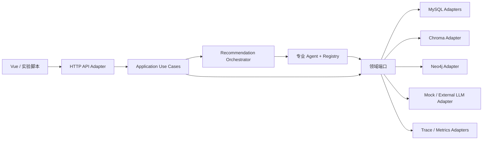

# ADR-0001：模块化单体、端口适配器与进程内多智能体

> 状态：Accepted
> 决策日期：2026-08-02
> 决策所有者：LibraMAS 项目
> 适用阶段：G0—G10
> 需求基线：`docs/LibraMAS_纯推荐模块实施文档_可运行版.md`
> 安全基线：`docs/LibraMAS_系统实施计划_安全低耦合版.md`

## 1. 决策摘要

LibraMAS 采用以下架构基线：

1. 后端采用按业务能力拆分的模块化单体，不在原型阶段拆分微服务。
2. 领域逻辑采用端口—适配器结构，框架和数据库位于依赖方向的最外层。
3. 九个逻辑 Agent 在同一进程内运行，通过 Orchestrator 和结构化消息协作。
4. MySQL 是唯一事实源；Chroma 和 Neo4j 是带版本的可替换派生索引。
5. 每个业务模块只维护自己拥有的数据，并通过公开端口交换最小 DTO。
6. 所有事实变更以追加、版本化或补偿方式表达，不提供物理删除能力。

本 ADR 是代码依赖、事务边界和数据所有权的规范性依据。若后续实现需要违反本 ADR，必须先新增一份 ADR，说明动机、影响、替代方案和迁移路径；不能用临时跨模块导入规避边界。

## 2. 背景与问题

系统需要同时满足两类目标：

- 研究目标：展示多智能体基于意图、画像、资源覆盖、反馈和证据状态进行动态协同。
- 工程目标：单机可运行、无外部大模型密钥也可演示、部分依赖故障时可降级、结果可复现和审计。

若直接拆为多个 Agent 微服务，研究原型会承担服务发现、消息队列、分布式事务和跨进程追踪等额外成本。若全部代码按 Controller、Service、Repository 横向堆放，又会导致任意模块读取任意表、Agent 直接操作 ORM、排序依赖具体召回实现等高耦合问题。

因此需要在保持部署简单的同时，建立可以由测试强制执行的逻辑边界。

## 3. 决策驱动因素

按优先级排列：

1. 保证既有文件和数据库事实不因实现、测试或实验而被破坏。
2. 支持完整的推荐、澄清、曝光、反馈和画像更新闭环。
3. 让 Agent 的角色、观察范围、动作和失败语义可以被论文实验测量。
4. MySQL-only 模式也能返回可解释的降级结果。
5. 领域规则可在不启动 Web 服务或真实数据库的条件下单元测试。
6. Chroma、Neo4j、LLM 和框架可以独立替换。
7. 单人研究项目可以在可控时间内实现、调试和复现。

## 4. 采用的总体结构



部署单元可以只有后端、Worker 和前端三个进程；逻辑模块边界不等于进程边界。进程内调用仍必须经过公开应用接口或端口，不能因为共用 Python 进程而绕过契约。

## 5. 业务模块与所有权

### 5.1 模块清单

| 模块 | 高内聚职责 | 数据所有权 | 对外公开能力 | 明确不负责 |
|---|---|---|---|---|
| `catalog` | 馆藏资源、标签、可用性、元数据版本、热度快照和索引计划 | `resource_*`、`tag_dictionary`、`resource_tag`、`resource_index_outbox` | `ResourceQueryPort`、`CatalogImportUseCase`、`IndexPlanPort` | 用户画像、策略决策、最终排序 |
| `profile` | 行为事实、声明画像、兴趣/负偏好投影、阅读阶段和历史时点重放 | `user_behavior_event`、`user_declared_profile*`、`user_profile`、`user_interest_tag`、`user_negative_preference`、`profile_change_log`、`profile_update_outbox` | `BehaviorAppendPort`、`ProfileSnapshotPort`、`ProfileRefreshUseCase` | 输出类型选择、推荐记录写入 |
| `recommendation` | 任务状态机、Agent 编排、资源探测、策略、召回、排序、组合输出和解释 | `recommendation_task`、上下文/策略/Agent 日志、候选、记录、分组、条目和解释 | `RecommendUseCase`、`ClarifyUseCase`、`RecommendationQueryPort`、`ExplainUseCase` | 修改馆藏事实或画像事实 |
| `feedback` | 曝光事实、反馈事实、资源级抑制状态和画像增量提案 | `recommendation_impression`、`recommendation_feedback`、`user_resource_state` | `RecordExposureUseCase`、`ApplyFeedbackUseCase`、`SuppressionSnapshotPort` | 直接重算整份画像或重排既有结果 |
| `observability` | Trace 查询、状态迁移审计、指标和验收证据 | `domain_state_transition`、观测投影与指标输出 | `TraceQueryPort`、`MetricSinkPort`、`AuditSinkPort` | 业务决策和事实修改 |
| `evaluation` | 数据切分、基线、消融、评估和不可变实验产物 | `experiments/runs/{run_id}` | `ExperimentRunner`、`Evaluator` | 修改在线配置和历史运行产物 |
| `platform` | 配置装配、连接、权限守卫及端口的基础设施实现 | 不拥有业务事实 | Adapter 实现与 Composition Root | 推荐规则和跨域业务流程 |
| `api` | HTTP DTO、鉴权、幂等头解析和错误映射 | 不拥有业务事实 | `/api/v1` | 直接读取 ORM 或开启数据库事务 |

### 5.2 所有权规则

1. 表所有者是唯一可以定义该表写模型的模块。
2. 其他模块不得直接导入该表的 ORM Model 或 Repository 实现。
3. 跨域读取通过查询端口返回不可变 DTO；跨域写入通过命令端口或领域事件表达。
4. 为性能建立的只读投影必须有版本、来源、刷新语义和独立 ADR。
5. 共享 MySQL 实例不构成共享表所有权。
6. `recommendation_config_version` 由 Recommendation 模块解释，由 Platform 在启动时装载；其他模块只接收不可变的 `ConfigBundle` 值对象。

## 6. 建议代码结构

```text
backend/app/
├── shared_kernel/
│   ├── domain/              # ID、Clock、Result、错误、版本值对象
│   └── contracts/           # 无框架依赖的跨域 DTO
├── catalog/
│   ├── domain/
│   ├── application/
│   ├── ports/
│   └── adapters/
├── profile/
│   ├── domain/
│   ├── application/
│   ├── ports/
│   └── adapters/
├── recommendation/
│   ├── task/
│   ├── policy/
│   ├── retrieval/
│   ├── ranking/
│   ├── explanation/
│   ├── agents/
│   ├── ports/
│   └── adapters/
├── feedback/
│   ├── domain/
│   ├── application/
│   ├── ports/
│   └── adapters/
├── observability/
├── evaluation/
├── api/
└── platform/
```

`shared_kernel` 只能包含稳定、无业务偏向且至少被两个域真正共享的概念。不得创建无限增长的 `common`、`utils` 或 `helpers` 目录。

## 7. 依赖规则

### 7.1 允许的依赖方向

```text
HTTP/CLI Adapter → Application Use Case → Domain + Port
Infrastructure Adapter → Port + Domain DTO
Agent → 专属 Command DTO + Port
Domain → shared_kernel/domain
Composition Root → 所有需要装配的公开模块
```

### 7.2 禁止的依赖

- Domain 导入 FastAPI、SQLAlchemy、Chroma、Neo4j Driver 或具体 LLM SDK。
- API 导入 ORM Model、数据库 Session 或具体 Repository。
- Agent 导入另一个 Agent 的实现类。
- Agent 直接执行 SQL、Cypher、向量集合操作或文件系统操作。
- Ranking 导入具体 Recall Channel 或根据基础设施类型分支。
- Explanation 重新召回、重新排序或修改证据。
- Profile 直接写 Recommendation 的结果表。
- Feedback 直接覆盖画像投影；它只追加事实并提交 Delta 提案。
- 任意模块导入另一个模块的 `adapters` 或内部实现。

### 7.3 公开边界

每个模块只通过以下位置暴露符号：

```text
<module>/application/public.py
<module>/ports/public.py
<module>/domain/public.py        # 仅必要的稳定值对象
```

跨模块 DTO 优先放在提供方的 `application/public.py`。只有真正跨多个域且语义稳定的 ID、时间和 Result 类型可以进入 `shared_kernel`。

## 8. 核心端口契约

以下是语义契约，不要求 G0 即实现具体类：

| 端口 | 提供方 | 使用方 | 输入 | 输出 | 失败语义 |
|---|---|---|---|---|---|
| `ResourceQueryPort` | Catalog | Recommendation | `ResourceQuery`、`evaluation_at` | `ResourceSnapshot[]` | 核心 MySQL 不可用为失败；空集合是合法结果 |
| `VectorSearchPort` | Catalog Adapter | Recommendation Recall | 查询向量、版本、Top-K、时间过滤 | `ChannelCandidate[]` | 超时/版本不匹配为可降级状态 |
| `GraphSearchPort` | Catalog Adapter | Recommendation Recall | 锚点、图版本、Top-K、时间过滤 | `ChannelCandidate[]` | 超时/图不可用为可降级状态 |
| `PopularitySnapshotPort` | Catalog | Recommendation | 类型、`evaluation_at`、数据集/公式版本 | `PopularityFeature[]` | 无合格快照返回 `SKIPPED` |
| `BehaviorAppendPort` | Profile | API/Feedback | 幂等行为命令 | `BehaviorReceipt` | 同 UUID 返回原回执，不重复追加 |
| `ProfileSnapshotPort` | Profile | Recommendation | 用户、时点、模式、公式版本 | `ProfileSnapshot` | 无画像返回冷启动快照，不伪造历史 |
| `SuppressionSnapshotPort` | Feedback | Recommendation | 用户、时点 | `ResourceStateSnapshot` | 只返回时点有效状态 |
| `RecommendationStorePort` | Recommendation | Recommendation Use Case | 任务、决策、结果、解释 | 持久化回执 | 单一事务失败则不发布完成状态 |
| `ExposureAppendPort` | Feedback | API | 曝光批次 | 逐项回执 | 重复 UUID 幂等，非法关联逐项拒绝 |
| `FeedbackAppendPort` | Feedback | API | 反馈命令 | 事实与画像更新状态 | 事实提交和 Outbox 必须同事务 |
| `LLMProviderPort` | Platform | Intent/Explanation | 受限结构化请求 | 结构化结果 | 无效输出最多重试一次后回退 |
| `ClockPort` | Platform | 所有用例 | 无或冻结时点 | UTC 时间 | 一个任务只固定一次 `evaluation_at` |
| `UnitOfWorkPort` | 各数据所有者 | 对应 Use Case | 事务函数 | Commit Receipt | 不暴露跨模块数据库 Session |

端口不得包含 `delete`、`truncate`、`reset`、`drop` 或同义的物理清理能力。资源退出服务使用状态变更和新版本；用户撤回使用追加撤回事件或停用状态。

## 9. Agent 边界与协作方式

### 9.1 逻辑 Agent

系统包含九个逻辑 Agent：

1. `RecommendationOrchestratorAgent`
2. `IntentUnderstandingAgent`
3. `UserProfileAgent`
4. `ResourceSemanticAgent`
5. `RecommendationPolicyAgent`
6. `CandidateRecallAgent`
7. `RankingAgent`
8. `ExplanationAgent`
9. `FeedbackLearningAgent`

Agent 必须同时具备 Role、Goal、Observation、Tools、Policy、Action、Confidence 和 Trace。仅封装数据库函数且没有局部决策的组件是 Service，不命名为 Agent。

### 9.2 协作约束

- Orchestrator 是唯一推进 `RecommendationTask` 全局状态机的组件。
- 其他 Agent 返回 `AgentResult[T]`，不直接修改共享状态。
- Agent 之间只经 Orchestrator、Registry 和带版本的 `AgentMessage` 协作。
- 每个 Agent 只收到专属 Command DTO；不共享可任意修改的全局 State。
- 大对象保存为 `agent_artifact`，消息只传 Artifact ID 和内容哈希。
- 每条命令携带 `deadline_at`、`idempotency_key`、`context_version` 和 `schema_version`。
- `PARTIAL` 必须说明缺失能力；`FAILED` 不得返回伪造业务结果。
- 重规划最多一次，并写入新的 `plan_version` 和策略决策记录。

### 9.3 确定性服务边界

画像公式、RRF、特征计算、排序、MMR、时间过滤、事务写入和证据校验由确定性服务实现。Agent 可以选择工具和策略，但不得自由改写确定性服务返回的分数。

## 10. 事务与一致性

### 10.1 事务所有者

一个应用用例只能有一个 Unit of Work 所有者：

- 创建推荐任务：Recommendation。
- 保存最终记录、条目、解释与完成状态：Recommendation。
- 写行为事实与画像 Outbox：Profile。
- 写曝光事实及对应零分行为事实：Feedback 用例协调，通过 Profile 端口在同一 MySQL 事务适配器中原子提交。
- 写反馈事实、行为事实、资源状态和画像 Outbox：Feedback 用例协调，具体跨域事务由专用应用服务封装，不能把 Session 暴露给域对象。
- 资源导入与索引 Outbox：Catalog。

跨外部索引不使用分布式事务。MySQL 事实先安全提交，Worker 再按幂等键构建派生索引；失败版本保留并标记为非活动状态。

### 10.2 一致性类别

| 数据 | 一致性要求 |
|---|---|
| 任务、记录、条目、解释、最终状态 | 同一 MySQL 事务强一致 |
| 行为/反馈事实与相应 Outbox | 同一 MySQL 事务强一致 |
| 当前画像投影 | Outbox 驱动的最终一致；版本可审计 |
| Chroma/Neo4j 派生索引 | 版本化最终一致；旧活动版本继续服务 |
| Trace 与关键策略依据 | 业务完成前持久化；缺失则不得标记为完整 Trace |

## 11. 数据与文件安全决策

### 11.1 事实保留

- 行为、曝光、反馈、推荐结果、Agent 执行、配置和实验运行均保留原事实。
- 纠错通过新版本、撤回事件、补偿事件或状态转换表达。
- 外键统一使用 `RESTRICT` 或 `NO ACTION`，不配置级联物理删除。
- 资源索引退出使用 `DEACTIVATE`；旧集合、节点、关系和版本目录继续保留。
- 测试和演示每次使用新的 `test_run_id`、`fixture_generation` 和用户命名空间。
- 实验运行目录存在时拒绝同名写入，不覆盖既有输出。

### 11.2 权限边界

运行时 Adapter 使用不具备物理删除和 DDL 权限的账号。启动就绪检查发现超范围权限时：

1. `GET /api/v1/health/ready` 返回未就绪；
2. 写用例拒绝执行；
3. 记录审计告警；
4. 不尝试自动修正授权。

任何物理删除需求都不属于日常端口能力。出现该需求时必须停止任务，按项目安全计划提交精确目标、影响、备份和恢复演练报告，并等待用户单次明确批准。

## 12. 故障与降级

| 故障 | 决策 |
|---|---|
| MySQL 不可用 | 返回 `503 CORE_STORAGE_UNAVAILABLE`，不生成伪结果 |
| Chroma 不可用/超时 | 移除 Vector 通道，按健康通道重归一化 |
| Neo4j 不可用/超时 | 移除 Graph 通道和 `kg_score`，保留其他证据 |
| 外部 LLM 不可用 | 使用规则意图识别和模板解释 |
| 部分资源无向量/图路径 | 候选级缺失特征重归一化并降低证据置信度 |
| 候选质量不足 | 最多重规划一次；仍不足则同类型降级返回 |
| 画像更新 Worker 失败 | 事实保留，Outbox 进入可重试或 `DEAD` 状态并告警 |

降级必须在响应 `warnings`、策略决策、通道运行记录和 Agent Trace 中可见。

## 13. 被否决的方案

### 13.1 每个 Agent 独立微服务

暂不采用。它增加网络协议、消息中间件、分布式追踪和事务复杂度，但不会自动增强 Agent 的自主性或论文论证。若未来出现独立扩缩容、独立发布或跨语言的明确需求，再通过新 ADR 评估拆分。

### 13.2 传统横向分层单体

不采用全局 Controller/Service/Repository 目录。该结构容易形成跨域查询和共享业务服务，无法清晰证明模块所有权。

### 13.3 让 Agent 直接访问数据库和工具 SDK

不采用。它会绕过权限、事务、时间过滤、幂等和审计规则，也使单元测试依赖真实基础设施。

### 13.4 让 Chroma 或 Neo4j 成为事实源

不采用。二者只保存可重建派生结构，所有推荐审计所需的版本和证据引用必须落在 MySQL。

## 14. 结果与权衡

### 14.1 正面结果

- 单一部署保持原型可运行性。
- 业务域和端口边界可由静态测试验证。
- Agent 的决策性与确定性算法分离，研究变量更清晰。
- 可选基础设施可以独立故障和替换。
- 数据变更、推荐结果和实验运行都能追溯版本。

### 14.2 成本

- 需要为跨域交互维护 DTO 和端口。
- 模块化单体仍需持续执行架构测试，否则边界可能退化。
- 某些跨域原子事务需要专用应用服务和受控适配器，设计成本高于直接共享 Session。
- 版本化保留会增加存储占用，需要容量监控，但不能以自动清理代替治理。

## 15. 架构验收规则

G1 起至少实现以下自动门禁：

```text
ARCH-01 domain 不得导入 fastapi/sqlalchemy/chromadb/neo4j 或具体 LLM SDK
ARCH-02 api 不得导入 ORM Model 或数据库 Session
ARCH-03 agents 不得导入其他 Agent 实现或 infrastructure adapter
ARCH-04 ranking 不得导入具体 Recall Channel
ARCH-05 explanation 不得导入 Recall、Ranking 或 Repository 实现
ARCH-06 模块间只能导入 public API、Port 或 shared_kernel
ARCH-07 Repository/Port 公开接口不得包含物理删除能力
ARCH-08 ORM Model 不得离开 Adapter 边界
ARCH-09 Chroma/Neo4j 适配器必须要求显式索引版本
ARCH-10 自定义历史时点必须走 `REPLAY_AS_OF`
```

验收证据应包含依赖图、违规样例失败结果和安全样例通过结果。

## 16. 变更规则

以下变化必须新增 ADR：

- 拆分进程或引入消息中间件；
- 新增业务域或变更表所有权；
- 绕过公开端口的跨域读写；
- 把派生索引提升为事实源；
- 引入跨域只读投影；
- 扩大运行账号权限；
- 改变零删除、实验冻结或历史时点规则。

本 ADR 本身通过新版本或后继 ADR 演进，不覆盖历史决策记录。
